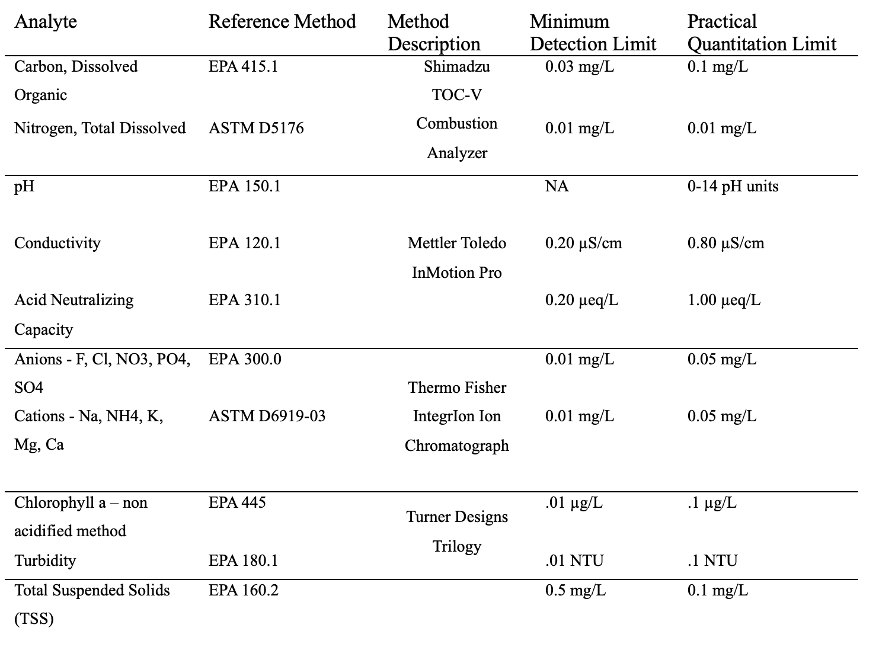

# Poudre Water Quality Network Study Chemistry Data

Current release: (09/2023- 12/2023)

Authors: Samuel J. Struthers (<https://orcid.org/0000-0003-1263-9525>),Timothy S. Fegel, Charles C. Rhoades (<https://orcid.org/0000-0002-3336-2257>), Matthew R.V. Ross (<https://orcid.org/0000-0001-9105-4255>)

**Data Description:** The majority of this dataset is water chemistry grab sample data collected in the Cache la Poudre Watershed in late 2023. These data are focused on basic water quality parameters, as well as cations and anions. Data were collected at various mainstem sites in the Cache la Poudre watershed as well as two tributaries of the Cache la Poudre River. This project is ongoing and additional data will be released as it is analyzed.

**Background Information:** Following a fish kill in the Cache La Poudre River in Fort Collins in 2018, the ROSS lab and the City of Fort Collins partnered to deploy water quality sensors thoughout the the Lower Cache La Poudre River (Canyon Mouth to Windsor) to track water quailty changes. In 2023, ROSS began collaborating with the Thomas lab in the CU Boulder Environmental Engineering Department to collect grab samples and additional sensor parameters to investigate drivers of water quality and build correlations betweeen water chemistry data and in situ water sensors. 

The primary data file is `data/cleaned/lower_poudre_chemistry_up_to_20231205.csv`. Column definitions and units are defined in the file `metadata/water_chemistry_units.xlsx`. Methods used to collect these data are outline below or in `metadata/rmrs_procedures.png`

Location metadata file is `data/metadata/sonde_location_metadata.csv`. A basic map showing all sampling locations is available at `site_map.html`.

Code is housed in the `scripts` folder and contains the following files:

-   `00_analysis_setup.R` provides loads packages and metadata files to be collated in `01_chem_prep.qmd`.

-   `01_chem_prep.qmd` adds metadata to most recent .csv of water chemistry data supplied by RMRS lab.

-   `sites_map.R` uses location metadata to create `site_map.html`

-   `demo.R` provides an example of how to download data from Zenodo directly in RStudio

Data are housed in the `data` folder and it contains the following:

-   `cleaned`: This folder contains the most recently available dataset and has associated burn severity and location data added to the chemistry data. The addition of the metadata was accomplished using the `01_chem_prep.qmd` R script.

-   `cleaned_archive`: This folder contains an archive of previously cleaned data. Downstream users are encouraged to use the collated data file `lower_poudre_chemistry_up_to_20231205.csv` in the `cleaned` directory.

-   `raw`: These data were directly received by the ROSSyndicate from RMRS lab managers. Downstream users are encouraged to use the collated data file `lower_poudre_chemistry_up_to_20231205.csv` in the `cleaned` directory.

-   `metadata`: this contains location data, parameter/column name definitions, units, and methods used at the RMRS Lab. The file `data/metadata/sonde_location_metadata.csv` contains basic location metadata supplied by Field Coordinator, Sam Struthers. 

Field measurements were taken using a Thermo Orion Star with RDO Optical and Conductivity probes. Times, when present, are listed in MST. Samples were collected and processed using the Rocky Mountain Research Station's Biogeochemistry Lab, overseen by Timothy Fegel and Charles Rhoades, according to the following methods:

**Funding:** This project was funded by the Thomas' Lab At CU Boulder in the Department of Enviornmental Engineering, in-kind support was given by In Situ Inc, ROSS lab and RMRS biogeochemistry lab. 

**Keywords**: Cameron Peak Fire, water quality, reservoirs, chlorophyll a, biogeochemistry

**Version**: v2023.12.13
